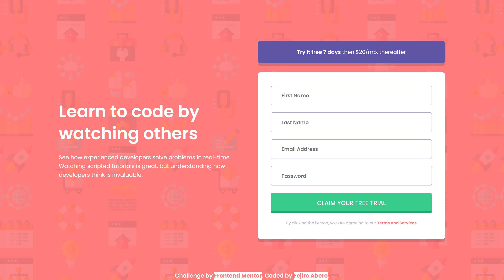

# Frontend Mentor - Intro component with sign up form solution

This is a solution to the [Intro component with sign up form challenge on Frontend Mentor](https://www.frontendmentor.io/challenges/intro-component-with-signup-form-5cf91bd49edda32581d28fd1). Frontend Mentor challenges help you improve your coding skills by building realistic projects.

## Table of contents

- [Overview](#overview)
  - [The challenge](#the-challenge)
  - [Screenshot](#screenshot)
  - [Links](#links)
- [My process](#my-process)
  - [Built with](#built-with)
  - [What I learned](#what-i-learned)
  - [Continued development](#continued-development)
  - [Useful resources](#useful-resources)
- [Author](#author)


## Overview

### The challenge

Users should be able to:

- View the optimal layout for the site depending on their device's screen size
- See hover states for all interactive elements on the page
- Receive an error message when the `form` is submitted if:
  - Any `input` field is empty. The message for this error should say _"[Field Name] cannot be empty"_
  - The email address is not formatted correctly (i.e. a correct email address should have this structure: `name@host.tld`). The message for this error should say _"Looks like this is not an email"_

### Screenshot



### Links

- Solution URL: [Solution]()
- Live Site URL: [Live Site](https://fejiro001.github.io/intro-component-with-signup-form-master/)

## My process

### Built with

- Semantic HTML5 markup
- CSS custom properties
- Flexbox
- CSS Grid
- Mobile-first workflow

### What I learned

For CSS:

```css
/* Animation for error message and icon */
@keyframes opacity {
  from {
    opacity: 0;
  }
  to {
    opacity: 1;
  }
}
@keyframes translate {
  from {
    transform: translateX(10px);
  }
  to {
    transform: translateX(0);
  }
}

/* Button click transition */
.btn-claim:active {
  opacity: 0.7;
  outline: none;
  transform: translateY(4px);
  transition: transform 100ms ease-in;
}
```

For JavaScript:
```js
// Changes error message content for email and password for pattern mismatch
const updateErrorMessage = function (index, message) {
  errorMessage[index].textContent = "Looks like this is not " + message;
};

// Displays error message and the error icon
const displayError = function (index) {
  const inputName = inputElements[index].dataset.name || "Field";
  inputElements[index].style.borderColor = "hsl(0, 100%, 74%)";
  errorMessage[index].textContent = inputName + " cannot be empty";
  errorMessage[index].classList.add("display-error");
  errorIcon[index].classList.add("display-error");
};

// Hides error message and the error icon
const hideError = function (index) {
  inputElements[index].style.borderColor = "hsl(246, 25%, 77%)";
  errorMessage[index].classList.remove("display-error");
  errorIcon[index].classList.remove("display-error");
};

// Changes input elements styling depending on validity and displays/hides error messages
const verifyInputs = function () {
  inputElements.forEach((input, index) => {
    if (input.value === "") {
      displayError(index);
    } else {
      hideError(index);
    }

    // Extra validation for email and password
    if (input.type === "email" && input.validity.patternMismatch) {
      displayError(index);
      updateErrorMessage(index, "an email");
    }
    if (input.type === "password" && input.validity.patternMismatch) {
      displayError(index);
      updateErrorMessage(index, "a password");
    }
  });
};

claimButton.addEventListener("click", verifyInputs);
```

### Continued development

I plan to gain more knowledge on Regex expressions.

### Useful resources

- [RegExr](https://regexr.com/7ts5n) - Used to test the password pattern
- [ChatGPT](https://chat.openai.com/c/1444193e-d800-4041-98d9-1085df2f7bbf) - Used ChatGPT to make sure code was clear, followed best practices and structured.

## Author

- Frontend Mentor - [@Fejiro001](https://www.frontendmentor.io/profile/Fejiro001)
- Twitter - [@aberefejiro](https://www.twitter.com/aberefejiro)
